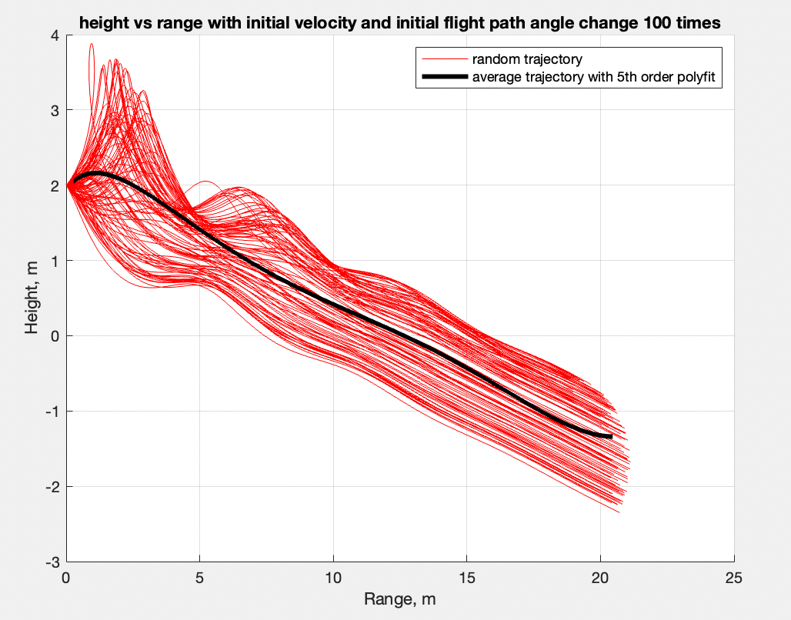
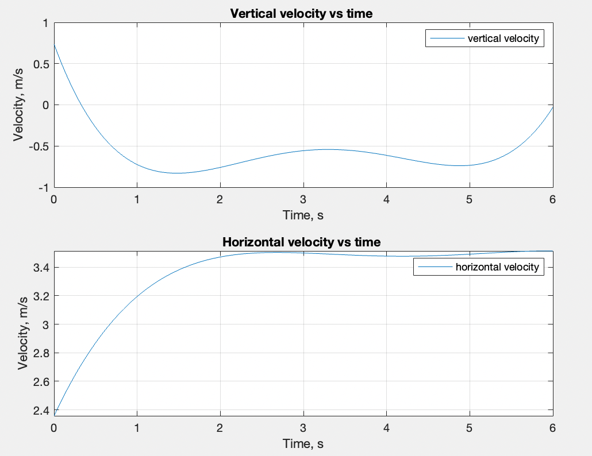

  # Paper Airplane Numerical Study
  Final Project: AEM 3103 Spring 2024

  - By: <Pengyang Li, ID: 5812974>

  ## Summary of Findings
  <Show the variations studied in a table>

  In this study, The flight path of a paper airplane was simulated 100 times, with different initial velocity and flight path angle which was shown in figure 2. 
  Here are some observations:
  1. Based on Fig. 1, the paper airplane's flight path becomes highly unstable with a high initial velocity, almost flipping over upon launch.
  2. Modifying the initial flight path angle minimally affects the trajectory.
  3. As per Fig. 3, the paper airplane trajectory involves a rapid descent in height and an initial increase in horizontal velocity post-launch, followed by a stable horizontal velocity until landing.
  
 
  # Code Listing

  1. [PaperPlane.m](./PaperPlane.m)
  This file include the data for the paper airplane and the script to simulate and graph all the following figures.
  2. [EqMotion.m](./EqMotion.m)
  This file is the function of the equation of motion for the paper airplane.
  3. [num_der_central.m](./num_der_central.m)
  This file is the function for calculating the derivative of the given data.
  4. [figs](./figs)
  The folder that include all the figures in readme.

  # Figures

  ## Fig. 1: Single Parameter Variation
  <2D trajectory simulated by varying single parameter at a time>
  
  <The above plot should also show the nominal trajectory>
  In the first figure, it shows the flight path of the paper airplane with highest, nominal and minmum initial velocity.
  In the second figure, it shows the flight path of the paper airplane with highest, nominal and minmum initial flight path angle.

  ## Fig. 2: Monte Carlo Simulation
  <2D trajectories simulated using random sampling of parameters, overlay polynomial fit onto plot.>

  In this figure, it shows 100 flight path of the paper airplane with different inital velocity and initial flight path angle. The black line is the average trajectory of the 100 path which fit with a 5th order polynominal. (The 5th order was used because the result line is smooth and is about in the center of all the other lines)

 ## Fig. 3: Time Derivatives
 <Time-derivative of height and range for the fitted trajectory>

The figures displays the derivative of the average flight path, derived from Figure 2.
The first figure illustrates the paper airplane's vertical velocity over time.
The second figure depicts the paper airplane's horizontal velocity over time.